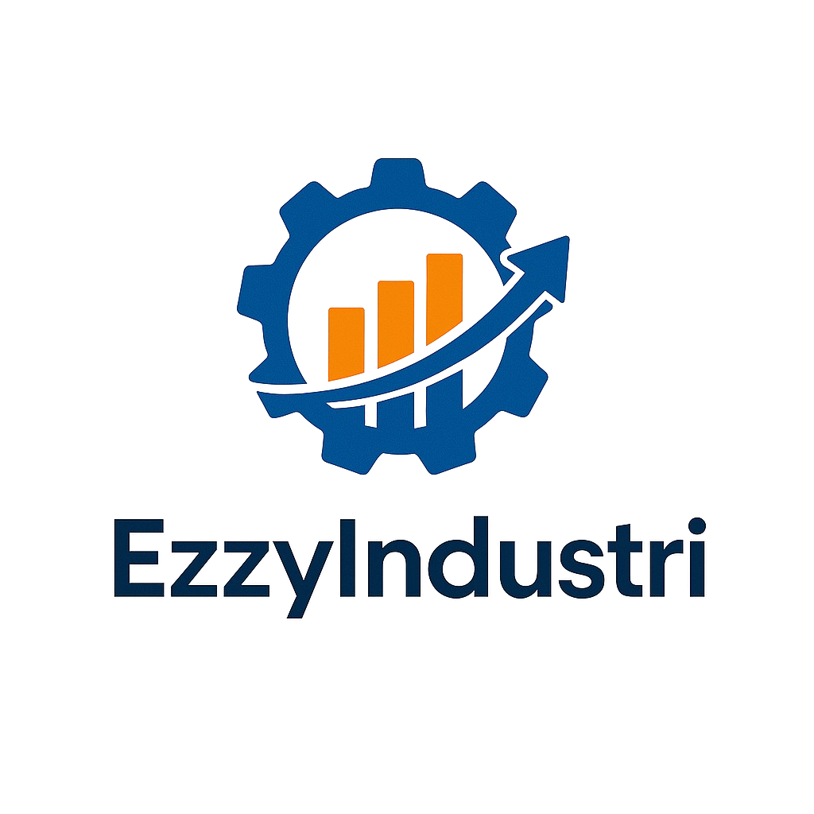

<p align="center"></p>

<p align="center">
<a href="https://github.com/abdulaziz2742/ezzy-industri-deploy-v1"></a>
<a href="https://github.com/abdulaziz2742/ezzy-industri-deploy-v1/blob/main/LICENSE"></a>
</p>

## About EzzyIndustri

EzzyIndustri adalah sistem manajemen produksi yang komprehensif untuk industri manufaktur. Sistem ini dirancang untuk mengoptimalkan proses produksi, meningkatkan efisiensi, dan memastikan kualitas produk yang konsisten.

### Fitur Utama

- **Manajemen Produksi**
  - Monitor produksi real-time
  - Perencanaan dan penjadwalan
  - Tracking progress produksi

- **Quality Control**
  - Inspeksi kualitas terstandar
  - Dokumentasi QC digital
  - Analisis data kualitas

- **Sistem Maintenance**
  - Jadwal maintenance preventif
  - Tracking riwayat maintenance
  - Manajemen spare part

- **Manajemen SOP**
  - Dokumentasi SOP digital
  - Sistem approval bertingkat
  - Distribusi SOP terintegrasi

- **OEE Monitoring**
  - Kalkulasi OEE real-time
  - Dashboard performa mesin
  - Analisis efisiensi produksi

- **Manajemen Downtime**
  - Tracking downtime detail
  - Analisis penyebab downtime
  - Pelaporan gangguan produksi

## Persyaratan Sistem

- PHP >= 8.1
- Laravel 10.x
- MySQL/MariaDB
- Node.js & NPM
- Composer

## Instalasi

```bash
# Clone repository
git clone https://github.com/abdulaziz2742/ezzy-industri-deploy-v1.git

# Install dependencies
composer install
npm install

# Setup environment
cp .env.example .env
php artisan key:generate

# Migrate database
php artisan migrate

# Build assets
npm run build
```
